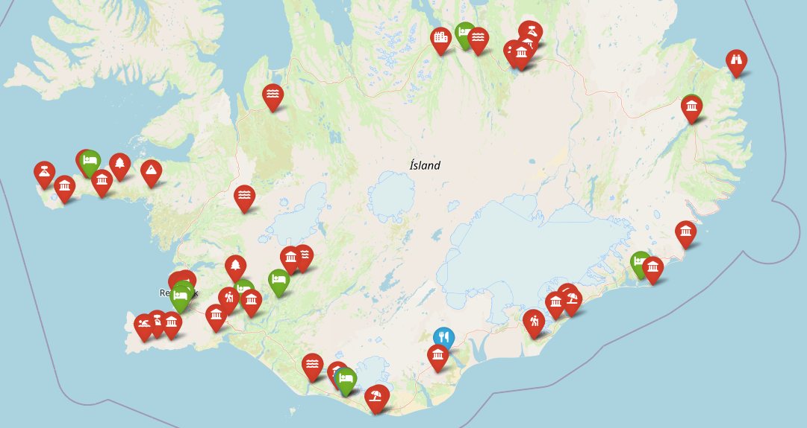
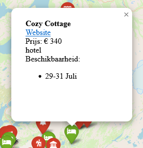
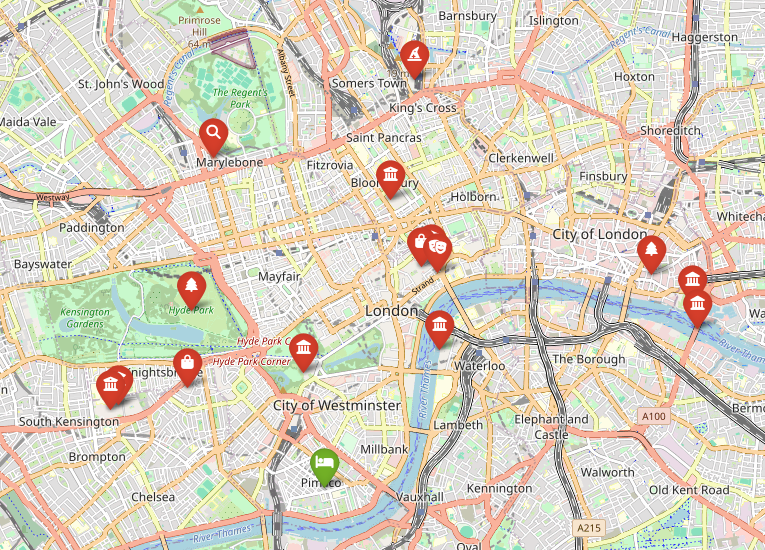

# Roadtrip planner
This repository is used for planning road trips. It creates a map where markers can be set to mark interesting points to visit. Markers have annotations to show more information. For example, price, availability and a link for hotels. 

---

## Dependencies

This repository mainly relies on these two packages:

- [Folium](https://github.com/python-visualization/folium): Python interface for creating a Leaflet.js map.
- [Geopy](https://geopy.readthedocs.io/en/stable/): Python client for gathering coordinates of locations.

To install the Python environment, see the `environment.yaml` file for Conda installations.

---

## Examples

### Road trip to Iceland:

Markers for sights are in red, hotels are in green and restaurants in blue. 



With information markers:



### City trip to London:



---

## Creating a road trip

Builing a map for a road trip consists of three stages:

- selecting interesting sites and finding their coordinates
- building a JSON file with markers
- assembling the final map

These steps are outlined below.

### 1. Selecting interesting sites

In order to pinpoint sites, hotels or restaurants on a map, the minimal requirement is the coordinate of that location.
To aid the retrieval of coordinates, there is the `Locator` class. This will search for the location (using `Geopy`) and return its coordinates.

```python
from src.main import Locator
locator = Locator()
locator("Platform 9 3/4")
>>> Getting location for Platform 9 3/4 ...
>>> Success!
>>> [38.2784282, -85.5366164]
```

These coordinates are, however, not the ones we were looking for as this points to a location in Louisville, Kentucky. Additional information can be given to the `locator` to make its search better. Think of it as searching on Google Maps.
```python
from src.main import Locator
locator = Locator()
locator("Platform 9 3/4", "London United Kingdom")
>>> Getting location for Platform 9 3/4 London United Kingdom...
>>> Success!
>>> [51.53218675, -0.12391369216957895]
```

### 2. Building a file with markers
All information about the location, markers and hotels is stored in a JSON file. The general structure of the JSON file is:
```json
{
    "main": {
        "coordinates": [0.0, 0.0],
        "country": "country name"
    },
    "markers": {
        "food": {
            "restaurant name": {...}
        },
        "hotel": {...},
        "landmark": {...}
    }
}
```

A marker dictionary should always contain a list of coordinates and the `info` key. The coordinate places the marker on the map and the `info` key will be the title of the pop-up annotation window. For example:
```json
{
    "Blue Lagoon": {
        "coordinates": [
            63.8813391,
            -22.4525679
        ],
        "info": "Geothermisch bad"
    }
}
```

Optional keys are the following:

- `icon`: custom icon to use instead of the default
- `website`: link to a website with more information
- `price`: entrance fee of a sight or hotel costs  
- `availability`: availability of hotels. Can be used for availability analysis later

All the optional keys will be added to the pop-up window when a marker is selected.

### 3. Assembling the map

To build the map with all the markers, the `MapMaker` class is used. here is a snippet of how to build the map:

```python
from src.main import MapMaker

# Initialize MapMaker object with JSON file
mm = MapMaker(map_item_filename="iceland_map_items.json")

# Create map
mm.main()

# Save map to HTML
mm.save_map("IcelandMap.html")
```

Alternative, there is a Jupyter notebook provided with each example to make the process faster and easier.
